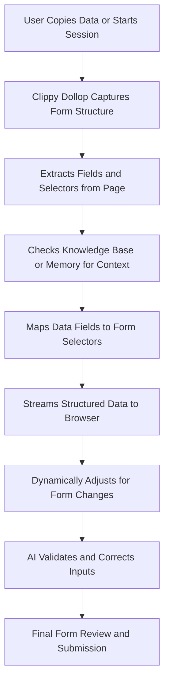

# clippyPour

Clippy-Pour is an AI-driven, clipboard-free form-filling automation system that streams structured form data directly into multiple web form fields. By leveraging the robust [Browser-Use](https://github.com/browser-use/browser-use) library and Playwright, Clippy-Dollop bypasses traditional clipboard mechanics, enabling faster and more efficient web automation.


---

## Features

- **Clipboard-Free Streaming:** Copy once and stream the data into several fields using a custom delimiter.
- **Efficient Form Filling:** Bypass OS clipboard limitations to fill out forms quickly.
- **Browser-Based Automation:** Built on Browser-Use’s powerful Playwright interface for real browser control.
- **Customizable Field Mapping:** Easily configure CSS selectors to target the appropriate form fields.
- **Async and Modular:** Developed using Python’s async framework for scalable and responsive automation.



---

## Requirements

- Python 3.11 or higher.
- [Browser-Use](https://github.com/browser-use/browser-use) library.
- Playwright (plus its dependencies and browser installations).
- Environment variables set in a `.env` file (e.g., API keys).

---

## Installation

1. **Clone the Repository:**

   ```bash
   git clone https://github.com/prompted365/clippypour.git
   cd clippypour
   ```

2. **Set Up a Virtual Environment (optional but recommended):**

   ```bash
   python -m venv venv
   source venv/bin/activate  # On Windows: venv\Scripts\activate
   ```

3. **Install Dependencies:**

   ```bash
   pip install -r requirements.txt
   ```

   > *Note: Ensure that Browser-Use and Playwright are installed. Then, install the Playwright browsers:*
   >
   ```bash
   playwright install
   ```

4. **Configure Environment Variables:**

   Create a `.env` file in the project root and add any necessary variables (e.g., API keys):

   ```bash
   OPENAI_API_KEY=your_openai_api_key_here
   ```

---

## Usage

Clippy-Dollop automates the process of filling out a web form by streaming a string of data—divided by the delimiter `||`—into predefined form fields. Simply update the form URL, data string, and field selectors in your script.

### Example Script

Below is a complete example of how to use Clippy-Dollop:

```python
import asyncio
from dotenv import load_dotenv
from langchain_openai import ChatOpenAI
from browser_use import Agent
from browser_use.browser import Browser, BrowserConfig

# Load environment variables from .env file
load_dotenv()

async def clippy_dollop_fill_form(form_url: str, form_data: str, field_selectors: list[str]) -> None:
    """
    Fill out a web form by streaming the provided form data into its fields.
    
    Args:
        form_url (str): URL of the form page.
        form_data (str): Clipboard text containing all form fields separated by the delimiter "||".
        field_selectors (list[str]): List of CSS selectors for each form field (in order).
    """
    # Initialize a browser instance using Browser-Use's Browser with a custom configuration.
    browser_config = BrowserConfig(headless=False)
    browser = Browser(config=browser_config)
    
    # Create an Agent instance with a dummy task description.
    task = "Fill out the form with the provided data using clippy-dollop method."
    llm = ChatOpenAI(model="gpt-4o")
    agent = Agent(task=task, llm=llm, browser=browser)
    
    # Navigate to the form URL.
    await agent.browser_context.navigate_to(form_url)
    await asyncio.sleep(2)  # Allow time for the page to load completely.
    
    # Split the form data using the delimiter "||"
    fields = form_data.split("||")
    if len(fields) != len(field_selectors):
        print("Error: Number of fields does not match number of selectors.")
        await browser.close()
        return

    # Fill each form field sequentially.
    for i, selector in enumerate(field_selectors):
        text = fields[i].strip()
        print(f"Filling field {i+1} with: {text}")
        page = await agent.browser_context.get_current_page()
        await page.fill(selector, text)
        await asyncio.sleep(0.5)  # Simulate a short typing delay.

    print("Form filling complete.")
    await browser.close()

if __name__ == "__main__":
    # Example usage:
    form_url = "https://example.com/form"  # Replace with your actual form URL
    # Example clipboard data with fields separated by "||"
    form_data = "John Doe || john.doe@example.com || 123 Main St || (555) 123-4567"
    # CSS selectors for each corresponding form field.
    field_selectors = [
        "#name",       # Selector for the name field
        "#email",      # Selector for the email field
        "#address",    # Selector for the address field
        "#phone"       # Selector for the phone field
    ]
    asyncio.run(clippy_dollop_fill_form(form_url, form_data, field_selectors))
```

---

## Testing

Run the test suite with pytest to verify that everything is working correctly:

```bash
pytest
```

---

## Contributing

Contributions are welcome! If you have suggestions or improvements, please open an issue or submit a pull request.

---

## License

This project is licensed under the MIT License. See the [LICENSE](LICENSE) file for more details.

---

Clippy-Dollop aims to redefine automated form filling with a seamless, clipboard-streaming approach. Enjoy and happy coding!
